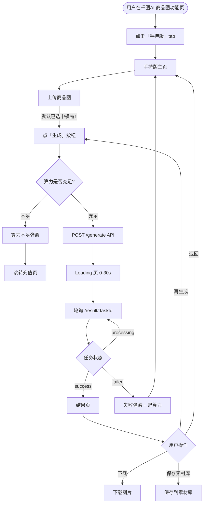
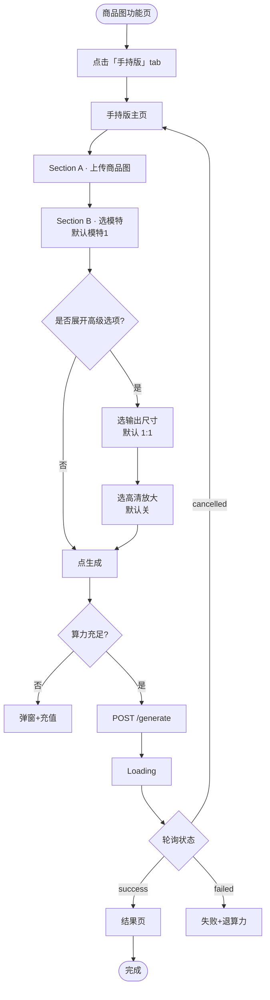
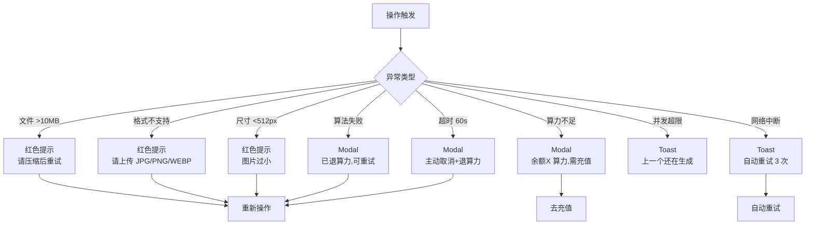
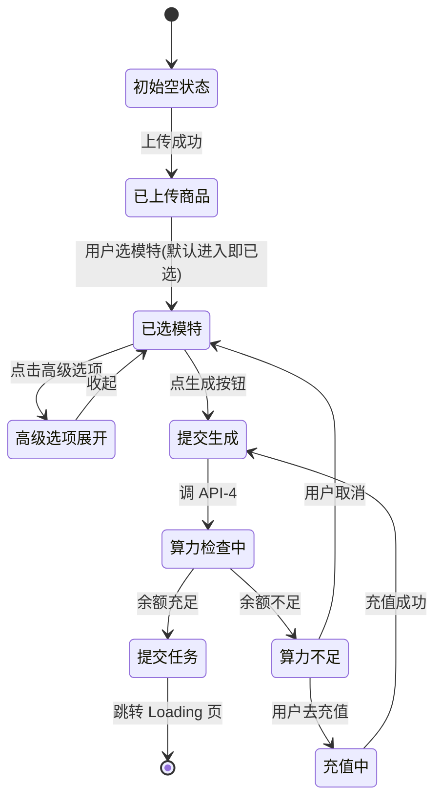
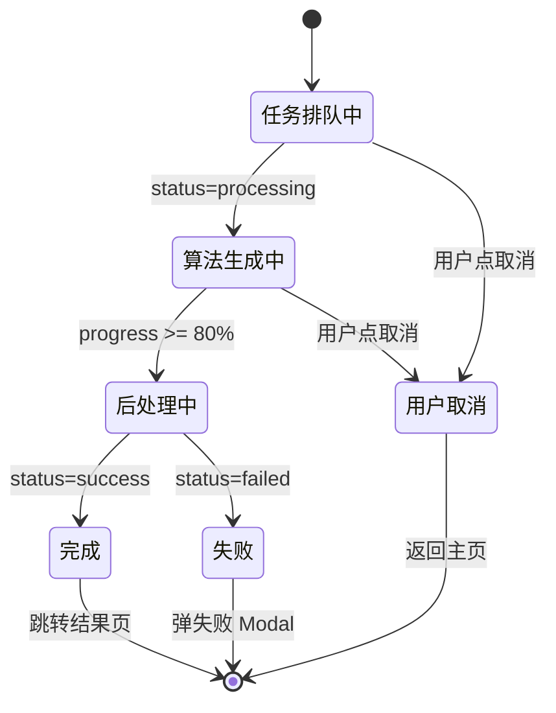

# 手持商品 MVP · 用户流程图

> M2 第二份产出 · 2026-05-26
> PRD 中流程的视觉化版本,供前端开发对照实现

---

## 一、主流程(80% 用户走的 3 步路径)

---

## 二、完整流程(含高级选项,4 步路径)

---

## 三、异常流程

---

## 四、屏幕状态机

每个屏幕的所有状态及切换条件:

### 屏 2 · 手持版主页 状态机

### 屏 3 · Loading 页 状态机

---

## 五、路径分析(数据团队备用)

### 期望路径分布

| 路径 | 步数 | 预期占比 | 备注 |
|---|---|---|---|
| **默认 3 步**(上传→默认模特→生成) | 3 | **70%** | 主流程,不操作模特和高级选项 |
| 4 步(默认+换模特) | 4 | 20% | 用户主动切换模特 |
| 4 步(默认+换尺寸) | 4 | 8% | 用户展开高级选项调尺寸 |
| 5 步(全自定义) | 5 | 2% | 既换模特又换尺寸,可能再开 HD |

### 监控:如果实际路径分布严重偏离

- "默认 3 步"占比 <40% → 默认值有问题(模特不好看?默认尺寸不对?)
- "高级选项展开率">30% → 默认设置不够好,用户被迫展开
- "再生成率">20% → 单次出图质量不行,用户在反复尝试

---

## 六、关键决策点(给开发的提示)

| 决策 | MVP 规则 | 反例 |
|---|---|---|
| 模特默认选中 | 第 1 个,API 返回 `isDefault: true` 的那个 | ❌ 让用户必须主动选,会损失 30% 完成率 |
| 上传完是否自动滚到下一段 | **否**,保持上下滚由用户决定 | ❌ 自动滚体验跳脱 |
| 生成按钮是否常驻 | 是,fixed 在底部或卡片底 | ❌ 隐藏在折叠区 |
| 高级选项默认 | 收起 | ❌ 展开会让默认 3 步变 5 步 |
| 失败后是否自动重试 | 后端自动重试 1 次,前端不重试 | ❌ 前端重试会重复扣算力 |
| Loading 页能否关闭 | 不能直接关,但能取消(扣算力) | ❌ 允许关闭会留下"幽灵任务" |

---

## 七、本文档迭代记录

| 日期 | 版本 | 更新内容 |
|---|---|---|
| 2026-05-26 | v0.1 | M2 初稿:主流程+完整流程+异常流程+状态机+路径分析 |
